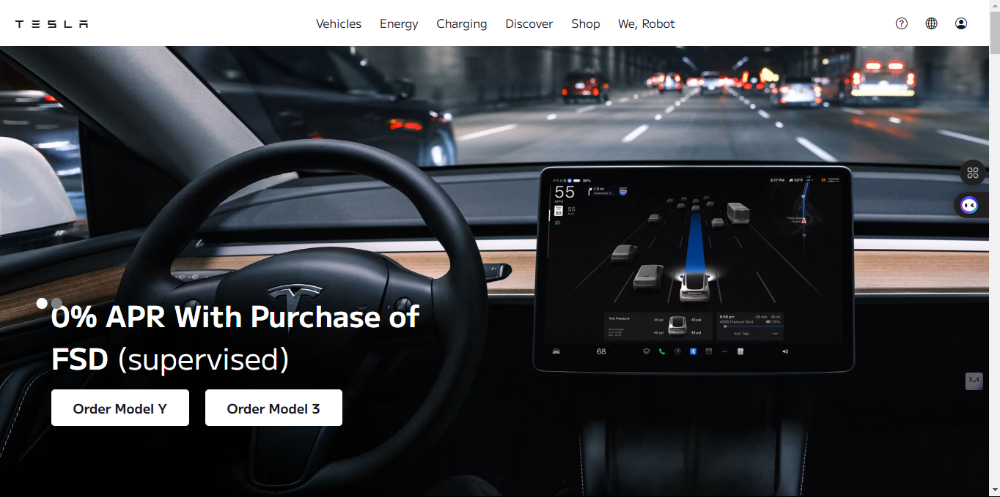

# Tesla Demo Page

A front-end demo showcasing Tesla’s electric cars and solar energy solutions.

## Table of Contents

- [Tesla Demo Page](#tesla-demo-page)
  - [Table of Contents](#table-of-contents)
  - [About the Project](#about-the-project)
  - [Features](#features)
  - [Technologies Used](#technologies-used)
  - [Getting Started](#getting-started)
    - [Prerequisites](#prerequisites)
    - [Installation](#installation)
  - [Usage](#usage)
  - [Demo](#demo)
  - [License](#license)

## About the Project

This project is a visual representation of Tesla’s electric vehicles and solar products. It highlights the company's commitment to sustainable energy with a modern, interactive design that mimics the Tesla aesthetic.

## Features

- **Electric Vehicles**: A section showcasing Tesla's electric car models with details on design, technology, and performance.
- **Solar Products**: Information on Tesla's solar panels and solar roofs, promoting energy efficiency and sustainability.
- **Hero Carousel**: Interactive image carousel for the main promotional visuals.
- **Responsive Layout**: Mobile and desktop-friendly design.
- **Call-to-Action Buttons**: Links to order Tesla models and explore more.

## Technologies Used

- **HTML**: Structure of the webpage.
- **CSS**: Styling and layout.
- **JavaScript**: Controls interactive elements like the carousel.

## Getting Started

To get a local copy up and running, follow these simple steps.

### Prerequisites

Ensure you have a text editor (e.g., VS Code) and a web browser.

### Installation

1. Clone the repository:
   ```bash
   git clone https://github.com/your-username/tesla-demo-page.git
2. Navigate to the project directory:
   ```bash
   cd tesla-demo-page
3. Open [Demo](https://chiduteslademo.netlify.app/) in a web browser to view the demo.
 ## Usage
- **Homepage**: Scroll through Tesla models and solar products.
- **Interactive Elements**: Hover over products or use the carousel buttons for a better viewing experience.

## Demo


## License
This project is for educational and demonstration purposes only. It is not affiliated with, endorsed by, or officially connected to Tesla, Inc.
